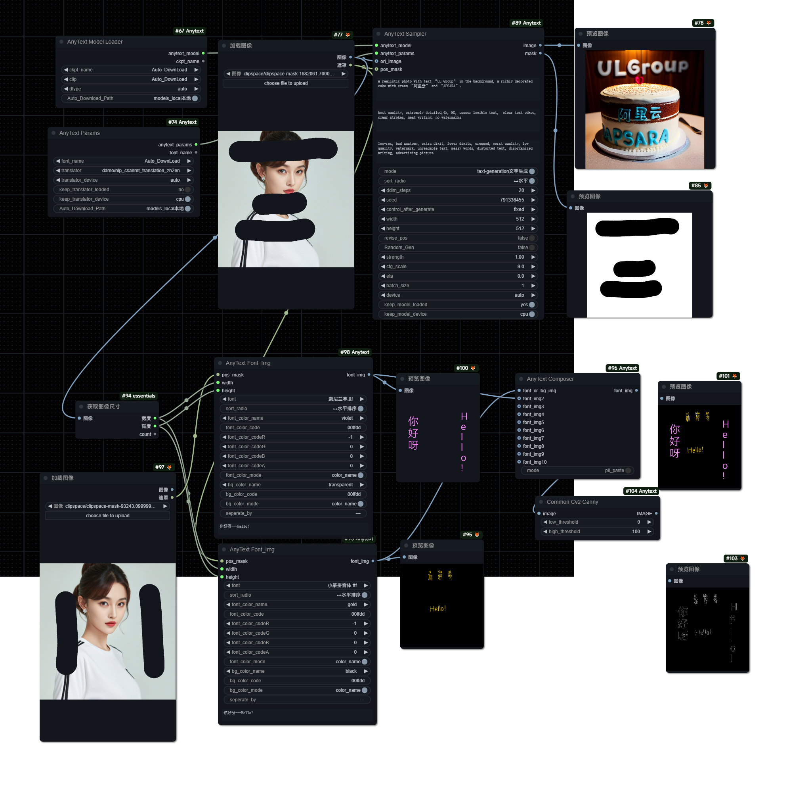

Unofficial custom_node for [AnyText: Multilingual Visual Text Generation And Editing](https://github.com/tyxsspa/AnyText)

# Look at the node tooltip for instrction.
# Improved custom_node from my codes before, split from my private node.
## AnyText Checkpoint: select Auto_Download from huggingface or manual download from huggingface or modelscope.
### Huggingface:
- fp16: https://huggingface.co/Sanster/AnyText/blob/main/pytorch_model.fp16.safetensors
- fp16: https://hf-mirror.com/Sanster/AnyText/blob/main/pytorch_model.fp16.safetensors (China mainland users)
- fp32: https://huggingface.co/Sanster/AnyText/blob/main/pytorch_model.safetensors
- fp32: https://hf-mirror.com/Sanster/AnyText/blob/main/pytorch_model.safetensors (China mainland users)
### Modelscope:
- https://modelscope.cn/models/iic/cv_anytext_text_generation_editing/resolve/master/anytext_v1.1.ckpt

## Clip model: select Auto_Download from huggingface or manual download or git clone from huggingface or modelscope.
### Huggingface:
- https://huggingface.co/openai/clip-vit-large-patch14
- https://hf-mirror.com/openai/clip-vit-large-patch14 (China mainland users)
### Modelscope:
- https://modelscope.cn/models/iic/cv_anytext_text_generation_editing/files

## Font: select Auto_Download from huggingface or manual download from huggingface or modelscope or use any other fonts.
### Huggingface:
- https://huggingface.co/Sanster/AnyText/blob/main/SourceHanSansSC-Medium.otf
- https://hf-mirror.com/Sanster/AnyText/blob/main/SourceHanSansSC-Medium.otf (China mainland users)
### Modelscope:
- https://modelscope.cn/studio/iic/studio_anytext/resolve/master/font/Arial_Unicode.ttf

### Workflow in workflow dir:
