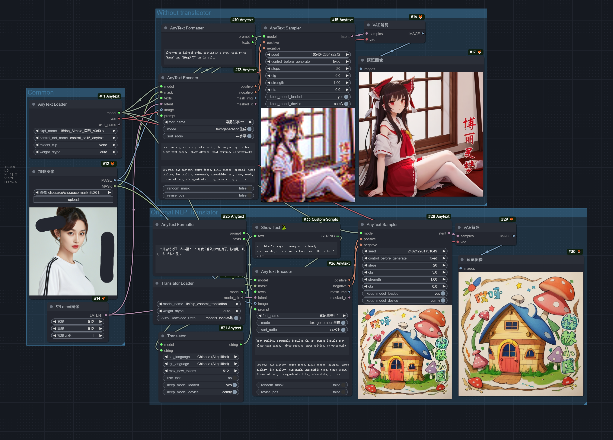
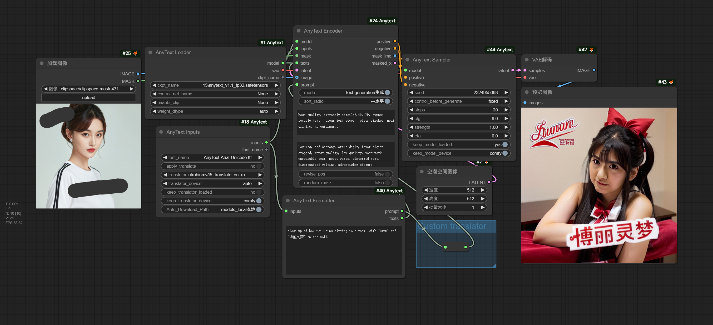

# Look at the node tooltip for instruction.

# 1、AnyText: Unofficial custom_node for [AnyText: Multilingual Visual Text Generation And Editing](https://github.com/tyxsspa/AnyText)

## Option 1: any sd1.5 checkpoint with AnyText control model.
### Huggingface:
- https://huggingface.co/zmwv823/AnyText_control_model/blob/main/control_sd15_anytext_v1_1.safetensors
- https://hf-mirror.com/zmwv823/AnyText_control_model/blob/main/control_sd15_anytext_v1_1.safetensors (China mainland users)
### Workflow in example_workflows dir:

## Option 2: full AnyText checkpoint.
### Huggingface:
- fp16: https://huggingface.co/Sanster/AnyText/blob/main/pytorch_model.fp16.safetensors
- fp16: https://hf-mirror.com/Sanster/AnyText/blob/main/pytorch_model.fp16.safetensors (China mainland users)
- fp32: https://huggingface.co/Sanster/AnyText/blob/main/pytorch_model.safetensors
- fp32: https://hf-mirror.com/Sanster/AnyText/blob/main/pytorch_model.safetensors (China mainland users)
### Modelscope:
- https://modelscope.cn/models/iic/cv_anytext_text_generation_editing/resolve/master/anytext_v1.1.ckpt
### Workflow in example_workflows dir:

### ~~If want chinese prompt without translator, use MiaoBi clip.~~(Not recommended, will be removed in future.)
### ~~Huggingface:~~
- ~~https://huggingface.co/ShineChen1024/MiaoBi/blob/main/miaobi_beta0.9/text_encoder/model.safetensors ()~~
- ~~https://hf-mirror.com/ShineChen1024/MiaoBi/blob/main/miaobi_beta0.9/text_encoder/model.safetensors (China mainland users)~~
### ~~Workflow in example_workflows dir:~~

## Font: select Auto_Download from huggingface or manual download from huggingface or modelscope or use any other fonts in `ComfyUI\models\fonts`.
### Huggingface:
- https://huggingface.co/Sanster/AnyText/blob/main/SourceHanSansSC-Medium.otf
- https://hf-mirror.com/Sanster/AnyText/blob/main/SourceHanSansSC-Medium.otf (China mainland users)
### Modelscope:
- https://modelscope.cn/studio/iic/studio_anytext/resolve/master/font/Arial_Unicode.ttf

## Zh to En Translators: 
### T5: Auto_Download from huggingface or manual download or git clone from huggingface into `ComfyUI\models\prompt_generator\models--utrobinmv--t5_translate_en_ru_zh_small_200`.
- https://huggingface.co/utrobinmv/t5_translate_en_ru_zh_small_1024
- https://hf-mirror.com/utrobinmv/t5_translate_en_ru_zh_small_1024 (China mainland users)
### nlp_csanmt_translation_zh2en:  Auto_Download from modelscope or manual download or git clone from modelscope into `ComfyUI\models\prompt_generator\modelscope--damo--nlp_csanmt_translation_zh2en`.
- https://modelscope.cn/models/iic/nlp_csanmt_translation_zh2en

# 2、Glyph-ByT5: Unofficial custom_node for [Glyph-ByT5: A Customized Text Encoder for Accurate Visual Text Rendering](https://github.com/AIGText/Glyph-ByT5)--TEST FAILED ON MY PC

## Limitations: background result worse than original SDXL checkpoint, image resolution locked at 1024x1024, input mask and image aspect ratio must be 1:1.

## Place Glyph-ByT5 checkpoints in `ComfyUI\custom_nodes\ComfyUI_Anytext\Image_Generation\Glyph_SDXL\checkpoints`

## Place `google/byt5-small` text_encoder into `ComfyUI\models\text_encoders` or select Auto_Download from huggingface.
- https://huggingface.co/google/byt5-small
- https://hf-mirror.com/google/byt5-small (China mainland users)

<!-- ## For sdxl checkpoints, download [original_config_yaml](https://github.com/zmwv823/Stuffs/blob/master/sd_xl_base.yaml) and [inpaint_original_config_yaml](https://github.com/zmwv823/Stuffs/blob/master/sd_xl-inpainting_base.yaml) into `ComfyUI\models\configs`. -->

### Workflow in example_workflows dir:

# 3、JoyType: Unofficial custom_node for [JoyType: A Robust Design for Multilingual Visual Text Creation](https://github.com/jdh-algo/JoyType)

## It's a typical canny controlnet implementation by diffusers library.

## Comfy Ksampler workflow recommended, sd1.5、sd2.1、sdxl canny works.

## For JoyType controlnet, download from https://huggingface.co/jdh-algo/JoyType-v1-1M into `ComfyUI\models\controlnet`. It's a diffusers format canny controlnet, compitable with comfy sampler.

### Workflow in example_workflows dir:
